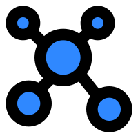

<a name="readme-top"></a>
[![Contributors][contributors-shield]][contributors-url]
[![Forks][forks-shield]][forks-url]
[![Stargazers][stars-shield]][stars-url]
[![Issues][issues-shield]][issues-url]
[![MIT License][license-shield]][license-url]

<!-- PROJECT LOGO -->
<br />
<div align="center">
  <a href="https://github.com/mark3labs/anyabi.xyz">
    
  </a>

<h3 align="center">AnyABI.xyz</h3>

  <p align="center">
    The easiest way to fetch an ABI.
    <br />
    <br />
    <a href="https://anyabi.xyz">Live Site</a>
    ·
    <a href="https://github.com/mark3labs/anyabi.xyz/issues">Report Bug</a>
    ·
    <a href="https://github.com/mark3labs/anyabi.xyz/issues">Request Feature</a>
  </p>
</div>


<!-- TABLE OF CONTENTS -->
<details>
  <summary>Table of Contents</summary>
  <ol>
    <li>
      <a href="#about-the-project">About The Project</a>
      <ul>
        <li><a href="#built-with">Built With</a></li>
      </ul>
    </li>
    <li>
      <a href="#getting-started">Getting Started</a>
      <ul>
        <li><a href="#prerequisites">Prerequisites</a></li>
        <li><a href="#installation">Installation</a></li>
      </ul>
    </li>
    <!-- <li><a href="#usage">Usage</a></li> -->
    <!-- <li><a href="#roadmap">Roadmap</a></li> -->
    <li><a href="#contributing">Contributing</a></li>
    <li><a href="#license">License</a></li>
    <li><a href="#contact">Contact</a></li>
    <li><a href="#acknowledgments">Acknowledgments</a></li>
  </ol>
</details>


<!-- ABOUT THE PROJECT -->
## About The Project

[![Product Name Screen Shot][product-screenshot]](https://example.com)


<p align="right">(<a href="#readme-top">back to top</a>)</p>

Quickly grab the ABI for ANY EVM smart contract on ANY EVM chain.

### Built With

* [![Svelte][Svelte.dev]][Svelte-url]
* [![Go][Go.dev]][Go-url]

<p align="right">(<a href="#readme-top">back to top</a>)</p>

<!-- GETTING STARTED -->
## Getting Started

Here's how to setup the project locally, develop an build.

### Prerequisites

You will need to following installed in order to develop locally.

- [Go](https://go.dev/)
- [PNPM](https://pnpm.io/)
- [Air](https://github.com/cosmtrek/air)


### Installation

1. Clone the repo
   ```sh
   git clone https://github.com/mark3labs/anyabi.xyz.git
   ```
2. Install [Task](https://taskfile.dev/installation/), [PNPM](https://pnpm.io/installation) and [Air](https://github.com/cosmtrek/air#installation)

3. Run the `setup` task
   ```sh
   task setup
   ```

### Development

1. Run the `dev` task

   ```sh
   task dev
   ```
   
### Building

1. Run the build task (output will be in `./bin`)

   ```sh
   task build
   ```

<p align="right">(<a href="#readme-top">back to top</a>)</p>

<!-- ROADMAP -->
<!-- ## Roadmap -->
<!---->
<!-- - [ ] Feature 1 -->
<!-- - [ ] Feature 2 -->
<!-- - [ ] Feature 3 -->
<!--     - [ ] Nested Feature -->
<!---->
<!-- See the [open issues](https://github.com/mark3labs/anyabi.xyz/issues) for a full list of proposed features (and known issues). -->
<!---->
<!-- <p align="right">(<a href="#readme-top">back to top</a>)</p> -->


<!-- CONTRIBUTING -->
## Contributing

Contributions are what make the open source community such an amazing place to learn, inspire, and create. Any contributions you make are **greatly appreciated**.

If you have a suggestion that would make this better, please fork the repo and create a pull request. You can also simply open an issue with the tag "enhancement".
Don't forget to give the project a star! Thanks again!

1. Fork the Project
2. Create your Feature Branch (`git checkout -b feature/AmazingFeature`)
3. Commit your Changes (`git commit -m 'Add some AmazingFeature'`)
4. Push to the Branch (`git push origin feature/AmazingFeature`)
5. Open a Pull Request

<p align="right">(<a href="#readme-top">back to top</a>)</p>


<!-- LICENSE -->
## License

Distributed under the MIT License. See `LICENSE.txt` for more information.

<p align="right">(<a href="#readme-top">back to top</a>)</p>


<!-- CONTACT -->
## Contact

Ed Zynda - [@what_the_func](https://twitter.com/what_the_func) - ezynda@mark3labs.com

Project Link: [https://github.com/mark3labs/anyabi.xyz](https://github.com/mark3labs/anyabi.xyz)

<p align="right">(<a href="#readme-top">back to top</a>)</p>


<!-- ACKNOWLEDGMENTS -->
## Acknowledgments

<p align="right">(<a href="#readme-top">back to top</a>)</p>

<!-- MARKDOWN LINKS & IMAGES -->
<!-- https://www.markdownguide.org/basic-syntax/#reference-style-links -->
[contributors-shield]: https://img.shields.io/github/contributors/mark3labs/anyabi.xyz.svg?style=for-the-badge
[contributors-url]: https://github.com/mark3labs/anyabi.xyz/graphs/contributors
[forks-shield]: https://img.shields.io/github/forks/mark3labs/anyabi.xyz.svg?style=for-the-badge
[forks-url]: https://github.com/mark3labs/anyabi.xyz/network/members
[stars-shield]: https://img.shields.io/github/stars/mark3labs/anyabi.xyz.svg?style=for-the-badge
[stars-url]: https://github.com/mark3labs/anyabi.xyz/stargazers
[issues-shield]: https://img.shields.io/github/issues/mark3labs/anyabi.xyz.svg?style=for-the-badge
[issues-url]: https://github.com/mark3labs/anyabi.xyz/issues
[license-shield]: https://img.shields.io/github/license/mark3labs/anyabi.xyz.svg?style=for-the-badge
[license-url]: https://github.com/mark3labs/anyabi.xyz/blob/master/LICENSE.txt
[product-screenshot]: screenshot.png
[Svelte.dev]: https://img.shields.io/badge/Svelte-4A4A55?style=for-the-badge&logo=svelte&logoColor=FF3E00
[Svelte-url]: https://svelte.dev/
[Go.dev]: https://img.shields.io/badge/go-%2300ADD8.svg?style=for-the-badge&logo=go&logoColor=white
[Go-url]: https://go.dev
